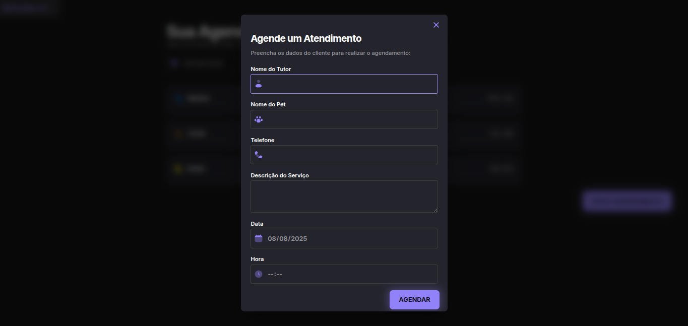

# Agendamento Petshop

Aplicação front-end para agendamento de serviços em petshops. Este projeto começou como um estudo da Rocketseat e recebeu um toque de melhorias adicionais: ajustes de UX/UI, padronização de datas com dayjs, cliente de API centralizado e, ao final, migração do build de Webpack para Vite para um fluxo de desenvolvimento mais rápido.

## 🔍 Preview

- Live: https://agendamento-petshop-chi.vercel.app/
- Screenshot:

<p align="center">
  
  <br/>
  <em>Layout com listagem por períodos e modal de agendamento</em>
  
</p>

## 🧭 Sobre o projeto

- Listagem de agendamentos por período do dia (manhã, tarde, noite).
- Criação de novos agendamentos via modal com blur e validações de formulário.
- Cancelamento com persistência no backend (json-server).
- Filtro por data com debounce para evitar requisições em excesso.

## 🛠️ Tecnologias

- Vercel (deploy/hosting e preview)
- Vite (dev server e build com Rollup)
- Vanilla JS (ESM)
- CSS puro
- dayjs (locale pt-BR + plugins)
- json-server (API fake)

## 📁 Estrutura (resumo)

```
.
├── index.html                # Entrada (Vite)
├── vite.config.js            # Configuração do Vite
├── server.json               # Banco de dados fake do json-server
├── src/
│   ├── index.js              # Bootstrap do app
│   ├── libs/day.js           # dayjs configurado
│   ├── core/api/client.js    # Cliente HTTP centralizado
│   ├── modules/              # Módulos de UI e fluxo
│   │   ├── page-load.js
│   │   ├── form-in.js
│   │   └── form/
│   │       ├── submit.js
│   │       └── create-schedule.js
│   ├── services/             # Serviços de dados (schedules)
│   │   └── schedule/
│   │       ├── fetch-schedule.js
│   │       ├── send-schedule.js
│   │       └── cancel.js
│   ├── utils/debounce.js
│   └── style/                # CSS
│       ├── global.css
│       ├── main.css
│       └── form.css
└── ...
```

## ✨ Melhorias aplicadas

- Modal com overlay/blur, bloqueio de scroll do body, ESC e clique no backdrop para fechar.
- Acessibilidade básica: role="dialog", aria-modal, foco no primeiro campo ao abrir.
- Cliente HTTP `apiClient` para padronizar GET/POST/DELETE e erros.
- Padronização de datas/hora via `src/libs/day.js` (pt-BR, utc, timezone, relativeTime).
- Filtro por data com `debounce` (UX mais suave e menos chamadas).
- Remoção persistente: item só sai do DOM após sucesso no DELETE.
- Limpeza de logs de debug e normalização da assinatura `fetchSchedule({ date })`.

## 🚚 Da migração Webpack ➜ Vite

Começamos com Webpack e, no final, migramos para Vite por:

- Startup instantâneo e HMR mais rápido.
- Configuração mais simples (index.html vira a entrada).
- Build de produção eficiente com Rollup.

Mudanças realizadas:

- Inclusão de `vite.config.js` e scripts no `package.json` (`dev`, `build`, `preview`).
- Adição de `<script type="module" src="/src/index.js"></script>` no `index.html`.
- Remoção do `webpack.config.js` e scripts do Webpack.

## ▶️ Como rodar

Pré-requisitos: Node.js (LTS)

- Instalar dependências

```zsh
npm install
```

- Subir API fake (json-server)

```zsh
npm run server
```

- Ambiente de desenvolvimento (Vite)

```zsh
npm run dev
```

Acesse: http://localhost:5173

- Build de produção

```zsh
npm run build
```

- Preview do build

```zsh
npm run preview
```

## � Deploy (Vercel)

1. Faça fork deste repositório (ou conecte-o na Vercel).
2. Em Project Settings > Environment Variables, crie `VITE_API_URL` apontando para sua API (ex.: `https://seu-backend.example.com`).

- Em dev local, use `.env.local` com `VITE_API_URL=http://localhost:3333` (veja `.env.example`).

3. Defina o framework como “Other” (é Vite puro) e mantenha os comandos padrão:

- Build Command: `npm run build`
- Output Directory: `dist`

4. Deploy e atualize o link na seção Preview.

## �🔌 API (json-server)

- Base: `http://localhost:3333`
- Recursos: `/schedules`
  - GET /schedules — lista todos os agendamentos
  - POST /schedules — cria um agendamento
  - DELETE /schedules/:id — remove um agendamento

O cliente HTTP usa `src/services/apiConfig.js` para definir `baseURL`.

## 🧪 Dicas de uso

- O input de data no header filtra a lista do dia.
- O formulário define `dateTime` automaticamente a partir de `date` + `hour`.
- O botão “Novo Agendamento” abre o modal centralizado com blur.

## 📌 Observações

- Este é um projeto de estudo da Rocketseat, com um toque de melhorias adicionais para reforçar boas práticas e padrões.
- Sinta-se à vontade para experimentar, refatorar e estender.

## 📜 Licença

ISC — consulte o `package.json`.
